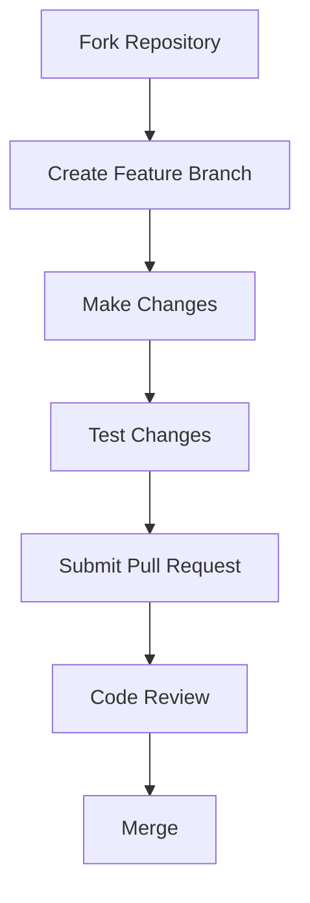

# 📝 Green Note

> A sleek, sustainable note-taking experience for Android that minimizes your digital footprint while maximizing productivity.


<p align="center">
  
</p>

## ✨ Features

### 🌿 Eco-Friendly by Design
- **Ultra-Efficient**: Engineered to minimize battery consumption and reduce your carbon footprint
- **Lightweight Footprint**: Tiny app size with optimized resource usage
- **Sustainable Development**: Built with environmentally conscious coding practices

### 💫 Powerful Functionality
- **Seamless Experience**: Fluid, intuitive interface that gets out of your way
- **Rich Formatting**: Express yourself with markdown-style text formatting
- **Smart Organization**: AI-powered suggestion system for tags and categories
- **Intelligent Search**: Find exactly what you need in milliseconds

### 🔒 Privacy First
- **Local Storage**: Your notes stay on your device by default
- **End-to-End Encryption**: Optional cloud sync with strong encryption
- **No Trackers**: Zero analytics, zero data collection

---

## 📱 Screenshots

<p align="center">
  
  
  
</p>

## 🚀 Getting Started

### Installation

```bash
# Available on Google Play Store
https://play.google.com/store/apps/details?id=com.alim.greennote

# Or build from source
git clone https://github.com/Alims-Repo/Green-Note.git
cd Green-Note
./gradlew installDebug
```

### System Requirements

| Requirement | Specification      |
|-------------|--------------------|
| Android Version | 6.0+ (Marshmallow) |
| Storage | 10MB minimum       |
| RAM | 50MB minimum       |
| Permissions | Notification       |

---

## 🛠️ Technology Stack

- **Frontend**: XML layouts with Material Design 3 components
- **Backend**: Java, Kotlin with modern architecture patterns (MVVM)
- **Database**: Room Persistence Library over SQLite

## 🧩 Architecture

```
com.alim.greennote/
├── data/
│   ├── models/
│   ├── repository/
│   └── database/
├── ui/
│   ├── activities/
│   ├── fragments/
│   ├── adapters/
│   └── viewmodels/
├── utils/
└── viewModel/
```

## 🤝 Contributing

We welcome contributions from the community! Check out our [Contribution Guidelines](CONTRIBUTING.md) to get started.



## 📜 License

Released under the MIT License. See [LICENSE](LICENSE) for details.

## 📮 Contact & Support

- **Email**: sourav.0.alim@gmail.com
- **GitHub**: [https://github.com/Alims-Repo/Green-Note](https://github.com/Alims-Repo/Green-Note)

---

<p align="center">
  <i>Made with 💚 for a greener digital world</i>
</p>